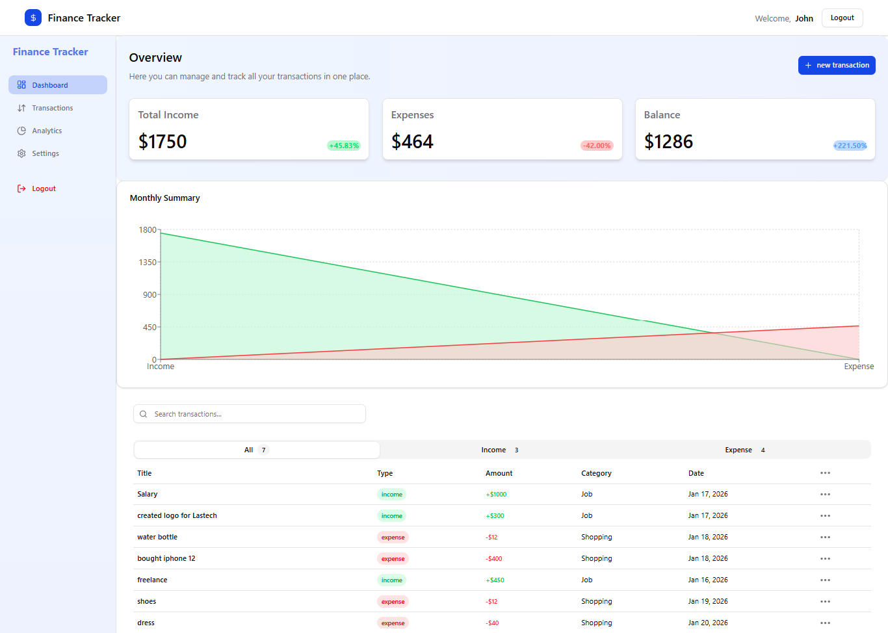

# 📊 Finance Tracker – Full Stack Application

A full-stack finance tracking application that helps users manage income and expenses, view monthly summaries, and analyze financial data using interactive charts.

---

## ✨ Features

- 🔐 User authentication (Register & Login)
- 💰 Add, edit, and delete transactions
- 📊 Monthly income & expense summary
- 📈 Interactive charts (Area, Line, Pie)
- 🗂 Transaction categorization
- 🌙 Dark mode support
- ⚡ Fast data fetching with React Query

---

## 🛠 Tech Stack

### Frontend
- React
- Tailwind CSS
- shadcn/ui
- Recharts
- React Router
- @tanstack/react-query
- Zustand (state management)

### Backend
- Node.js
- Express.js
- MongoDB
- Mongoose
- JWT Authentication
- bcrypt (password hashing)

---

## 📂 Project Structure

```bash
finance-tracker/
├── frontend/
│   ├── src/
│   │   ├── components/
│   │   ├── pages/
│   │   ├── hooks/
│   │   ├── lib/
│   │   └── main.jsx
│   └── package.json
│
├── backend/
│   ├── controllers/
│   ├── models/
│   ├── routes/
│   ├── middleware/
│   └── server.js
│
├── .env
├── README.md
└── package.json


## 🚀 Getting Started
1️⃣ Clone the Repository

git clone https://github.com/your-username/finance-tracker.git
cd finance-tracker


2️⃣ Backend Setup
cd backend
npm install


Create a .env file inside the backend folder:
PORT=5000
MONGO_URI=your_mongodb_connection_string
JWT_SECRET=your_jwt_secret


Run the backend server:
npm run dev


3️⃣ Frontend Setup
cd frontend
npm install
npm run dev


Frontend runs on:
http://localhost:5173


Backend runs on:
http://localhost:4000


```
----

## 📊 API Endpoints
#### Transactions

POST /api/transactions

GET /api/transactions

DELETE /api/transactions/:id

GET /api/transactions/monthly-summary


## Screenshots


---
## 🧠 What I Learned

- Building a full-stack MERN application

- Managing server state with React Query

- Visualizing data using Recharts

- JWT-based authentication

- Clean project structure for scalability
---

## 👤 Author

#### Sadia Mahamud

- GitHub: https://github.com/sadia-webdev

- Role: Computer Science Student & Full-Stack Developer


---
## ⭐ Support

If you like this project, please give it a ⭐ on GitHub!


---

If you want next:
- 🔥 **GitHub badges**
- 🧾 **Production deployment section**
- 🧠 **Recruiter-friendly version**

Just say the word 💙
